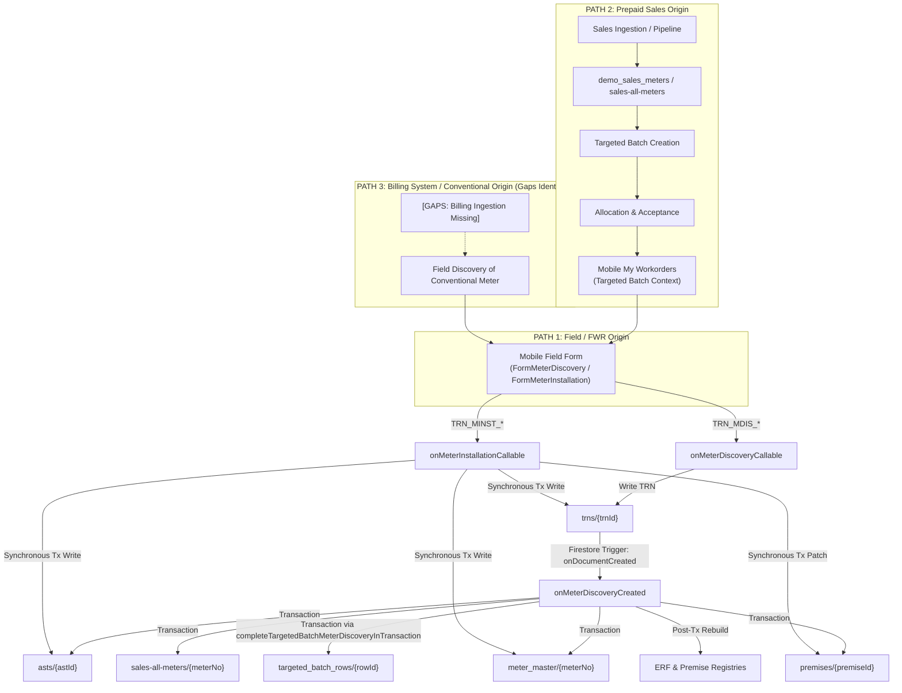

# iREPS Meter Registration and Meter Lifecycle Assessment

**Agent Name:** Gemini  
**Assessment Date:** 2026-08-07  
**Scope:** Read-Only Architecture and Code Assessment  
**Primary Repositories Inspected:** `C:\dev\ireps-web`, `C:\dev\ireps-mobile`  
**Reference Repositories Inspected:** `C:\dev\ireps-pipeline-sales`, `C:\dev\ireps-schemas`  

---

## 1. Repository State

The assessment was performed on local working trees in read-only mode without altering any application code, schemas, or Firestore state.

### Primary Repository 1: `ireps-web` (`C:\dev\ireps-web`)
* **Current Branch:** `main`
* **HEAD Commit:** `860f44add153151232a775705c4e2c85a5bea7db`
* **Git Status:**
  ```text
  M firestore.indexes.json
  M functions/scripts/tools/targeted-batches/01_read_targeted_batch_reset_scope_dev.js
  M functions/scripts/tools/targeted-batches/02_delete_batches_and_clean_demo_sales_dev.js
  M functions/targetedBatches/getTargetedBatchRowsCallable.js
  M functions/targetedBatches/recordTargetedBatchNoAccessCallable.js
  M src/pages/operations/TargetedBatchAllocationPage.jsx
  M src/pages/operations/TargetedBatchDetailsPage.jsx
  M src/pages/sales/SalesReportingPage.jsx
  M src/pages/sales/components/SalesBatchMapModal.jsx
  ?? functions/scripts/tools/targeted-batches/targetedBatchReset.helpers.js
  ?? functions/test/targetedBatchNoAccessRule.test.js
  ?? functions/test/targetedBatchReset.helpers.test.js
  ?? src/pages/sales/SalesBatchMapPage.jsx
  ?? src/pages/sales/components/MultiSelectFilter.jsx
  ?? src/pages/sales/components/SalesTargetedBatchMap.jsx
  ?? src/pages/sales/stats/SalesStatsCharts.jsx
  ```

### Primary Repository 2: `ireps-mobile` (`C:\dev\ireps-mobile`)
* **Current Branch:** `main`
* **HEAD Commit:** `0e39d5a3d24af927d64cc39d212e6c0a8b455ac1`
* **Git Status:**
  ```text
  M app/(tabs)/admin/operations/targeted-batch-no-access.js
  M components/forms/IrepsNoAccessSection.js
  M src/features/meters/FormMeterDiscovery.js
  M src/features/targetedBatches/targetedBatchActions.js
  M src/features/targetedBatches/targetedBatchActions.test.mjs
  M src/redux/targetedBatchApi.js
  ?? skills.md
  ?? src/features/meters/noAccessReasons.js
  ?? src/redux/targetedBatchApi.streaming.test.mjs
  ```

---

## 2. Executive Conclusion

1. **AST-Centric Lifecycle Principle: PASS.**  
   Once a physical meter is registered as an Asset (`asts/{astId}`), **all post-registration meter lifecycle TRNs** (`METER_INSPECTION`, `METER_REMOVAL`, `METER_DISCONNECTION`, `METER_RECONNECTION`, `METER_READING`, `METER_COMMISSIONING`) operate **100% origin-independently** against the registered AST. None of the post-registration lifecycle callables or triggers require sales data or care whether the meter entered iREPS via field discovery, prepaid sales, or conventional billing lists.

2. **Convergence of Registration Paths onto Generic Registration Mechanism: PARTIAL.**  
   * **Path 1 (Field / FWR Origin):** Fully supported for both `Meter Discovery` (`onMeterDiscoveryCallable` + `onMeterDiscoveryCreated`) and `Meter Installation` (`onMeterInstallationCallable`). Both write to `trns/{trnId}`, construct an AST in `asts/{astId}`, and link `meter_master/{meterNo}`.
   * **Path 2 (Prepaid / Vending Sales Origin):** Fully supported for `Meter Discovery`. Targeted Batch allocation and acceptance lead to mobile discovery execution. When `onMeterDiscoveryCreated` fires, `completeTargetedBatchMeterDiscoveryInTransaction` bridges the newly registered AST back to `targeted_batch_rows`, `targeted_batches`, and `demo_sales_meters.tbRefs`. However, `Meter Installation` (`onMeterInstallationCallable`) currently **lacks Targeted Batch completion logic**, creating an architectural discrepancy between the two registration TRN types.
   * **Path 3 (Billing System / Conventional Meter Origin):** **PARTIALLY SUPPORTED (Field discovery supported; Billing-supplied Targeted Batch pipeline NOT SUPPORTED).** Conventional meters can be discovered in the field and registered into `asts` (Path 1 style), after which conventional lifecycle TRNs (e.g. `METER_READING` / `MREAD`) operate cleanly against the AST. However, there is **no billing ingestion pipeline**, no `billing_meters` source collection, and Targeted Batch upload handlers strictly hardcode `demo_sales_meters` (`SALES_TARGETED_BATCH`).

3. **Structural Discrepancy Between Meter Discovery and Meter Installation:**  
   `Meter Discovery` delegates AST creation, Meter Master link, Sales All Meters sync, and Targeted Batch completion to an asynchronous Firestore trigger (`onMeterDiscoveryCreated` on `trns/{trnId}`). `Meter Installation` processes AST creation, Meter Master link, and Premise service updates synchronously inside `onMeterInstallationCallable`, omitting Sales All Meters sync, `trn.derived` marking, and Targeted Batch completion.

---

## 3. Current Registration Architecture Diagram



---

## 4. Path 1 Assessment: Field / FWR Origin

* **Supplied Meter List:** None (Unprompted / ad-hoc field discovery or installation).
* **Workflow Chain:**  
  `ERF` → `Premise` → `Meter` → `Meter Discovery` OR `Meter Installation` → `AST`.
* **Independence:** Completely independent of Sales or Billing data.
* **Execution Outcomes Supported:**
  1. Successful Meter Registration (Creates TRN + AST + Meter Master link).
  2. No Access (Creates TRN with `accessData.access.hasAccess = "no"`, `ast: null`; no AST created).

**Code Evidence:**
* Mobile UI entry point: [FormMeterDiscovery.js](file:///C:/dev/ireps-mobile/src/features/meters/FormMeterDiscovery.js#L132) and [FormMeterIstallation.js](file:///C:/dev/ireps-mobile/src/features/meters/FormMeterIstallation.js#L136).
* Backend Callables: [functions/index.js](file:///C:/dev/ireps-web/functions/index.js#L3057) (`onMeterDiscoveryCallable`) and [functions/index.js](file:///C:/dev/ireps-web/functions/index.js#L4812) (`onMeterInstallationCallable`).

---

## 5. Path 2 Assessment: Supplied Prepaid Data / Path 2

* **Supplied Meter List:** Exists in `demo_sales_meters` (and `sales-all-meters`).
* **Workflow Chain:**  
  `Prepaid/Vending supplied meter data` → `Sales Table` (`demo_sales_meters`) → `Targeted Batch` (`targeted_batches` & `targeted_batch_rows`) → `Allocation/Acceptance` → `ERF` → `Premise` → `Meter` → `Meter Discovery` → `AST` → `Meter Master` (`meter_master`) → `Sales All Meters` (`sales-all-meters`).
* **Current Registration Mechanism:** Uses standard Meter Discovery (`onMeterDiscoveryCallable` + `onMeterDiscoveryCreated`). No special Targeted Batch registration TRN exists.
* **Execution Outcomes Supported:**
  1. Successful Meter Registration (Completes row via `completeTargetedBatchMeterDiscoveryInTransaction`, sets `execution.status = "COMPLETED"`, populates `refs.meterId = astId`, `refs.trnId = trnId`).
  2. No Access (Executed via `recordTargetedBatchNoAccessCallable`; updates `targeted_batch_rows.execution.noAccessCount`, appends to `demo_sales_meters.tbRefs[].fieldWork.noAccess`, leaves row `IN_PROGRESS` for retry/revisit).

**Bridge Assessment:**  
Existing `meter_master` already acts as the canonical bridge:
`supplied meter` → `canonical meter number` → `meter_master/{meterNo}` (`refs.sales.id`, `refs.asts.id`) → `sales-all-meters`.

**Code Evidence:**
* Targeted Batch completion helper: [functions/targetedBatches/premiseLink.js](file:///C:/dev/ireps-web/functions/targetedBatches/premiseLink.js#L1437) (`completeTargetedBatchMeterDiscoveryInTransaction`).
* Sales sync from master: [functions/index.js](file:///C:/dev/ireps-web/functions/index.js#L1472) (`syncSalesAllMetersFromMaster`).
* Targeted Batch collections definition: [functions/targetedBatches/helpers.js](file:///C:/dev/ireps-web/functions/targetedBatches/helpers.js#L4) (`TARGETED_BATCH_COLLECTIONS.sales = "demo_sales_meters"`).

---

## 6. Path 3 Assessment: Conventional Supplied Meters / Path 3

* **Status Classification:** **PARTIALLY SUPPORTED (Field discovery supported; Billing-supplied Targeted Batch pipeline NOT SUPPORTED).**

### Detailed Breakdown:
1. **What Exists:**
   * Generic field Meter Discovery supports conventional meters (`meterType: "water"` or `meterType: "electricity"`; meter mode/tariff can be conventional).
   * Post-registration meter lifecycle TRNs explicitly support conventional meters (e.g. `METER_READING` / `MREAD` in [functions/registry/mread/generateMreadStaging.js](file:///C:/dev/ireps-web/functions/registry/mread/generateMreadStaging.js#L96) and `isConventionalAstMeter` in [functions/meterLifecycle/helpers.js](file:///C:/dev/ireps-web/functions/meterLifecycle/helpers.js#L487)).
   * Master duplicate gatekeeper (`meter_master`) and AST creation handle conventional meters identically to prepaid meters.

2. **What Is Missing (Gaps):**
   * **No Billing Import Pipeline:** No automated or manual ingestion routines exist for billing-system supplied conventional meter lists.
   * **Targeted Batch Hardcoding to Sales:** Targeted Batch collection configurations and schemas hardcode `sales: "demo_sales_meters"` ([functions/targetedBatches/helpers.js](file:///C:/dev/ireps-web/functions/targetedBatches/helpers.js#L4)).
   * **Targeted Batch Source Module Validation:** Targeted Batch callables strictly enforce `sourceModule === "SALES_TARGETED_BATCH"` ([functions/targetedBatches/recordTargetedBatchNoAccessCallable.js](file:///C:/dev/ireps-web/functions/targetedBatches/recordTargetedBatchNoAccessCallable.js#L123)). No `BILLING_TARGETED_BATCH` or generic `SUPPLIED_METER_TARGETED_BATCH` source module exists.

---

## 7. Meter Discovery — Required Code Trace

### Complete Trace:
1. **Mobile UI Action:** User submits [FormMeterDiscovery.js](file:///C:/dev/ireps-mobile/src/features/meters/FormMeterDiscovery.js).  
   Generates TRN ID via `buildMeterDiscoveryTrnId` (Format: `TRN_MDIS_{timestamp}_{ELC|WTR}_{wardPcode}_{erfNo}`).
2. **Client Call:** Invokes `httpsCallable(functions, "onMeterDiscoveryCallable")` with `cleanPayload` ([FormMeterDiscovery.js:L1184-L1218](file:///C:/dev/ireps-mobile/src/features/meters/FormMeterDiscovery.js#L1184-L1218)).
3. **Backend Gatekeeper Callable:** `onMeterDiscoveryCallable` in [functions/index.js:L3057](file:///C:/dev/ireps-web/functions/index.js#L3057):
   * Validates authentication and payload (`validateMeterCreationPayload`, prefix `TRN_MDIS_`).
   * Validates parent Premise existence (`db.collection("premises").doc(premiseId).get()`).
   * Normalizes meter number via `normalizeMeterNo(meterNoRaw)`.
   * Checks `meter_master/{meterNoNormalized}` for operational conflicts (`classifyOperationalAstChange`).
   * Saves payload to `trns/{trnId}`.
4. **Async Trigger Execution:** `onMeterDiscoveryCreated` (`onDocumentCreated("trns/{trnId}")`) in [functions/index.js:L1531](file:///C:/dev/ireps-web/functions/index.js#L1531):
   * Filters for `accessData.trnType === "METER_DISCOVERY"` and `hasAccess === "yes"`.
   * Runs `db.runTransaction`:
     * Calls `completeTargetedBatchMeterDiscoveryInTransaction`: If `targetedBatchContext` present, links AST & TRN to `targeted_batch_rows/{rowId}`, `targeted_batches/{tbId}`, and `demo_sales_meters/{salesDocId}.tbRefs`.
     * Upserts `meter_master/{meterNoNormalized}` (sets `refs.asts.id = astId`).
     * Creates AST in `asts/{astId}` (ID equals `trnId`). Sets `ast.master = { id: normalizedMeterNo, visibility }`.
     * Syncs `sales-all-meters/{meterNoNormalized}` via `syncSalesAllMetersFromMaster`.
     * Updates `premises/{premiseId}` (`occupancy.status = "Accessed"`).
     * Updates `trns/{trnId}` with `derived` block (`astId`, `master`, `targetedBatch`).
     * Updates `ireps_erfs/{erfId}` metadata.
   * Post-Transaction side effects: Rebuilds ERF meter counts (`rebuildErfMeterCounts`), ERF TRN counts (`rebuildErfTrnCount`), Premise meter counts (`rebuildPremiseMeterCounts`), and Premise registry row (`rebuildPremiseRegistryRow`).

### Parameter & Linkage Inventory (Meter Discovery):
* **Files:** `FormMeterDiscovery.js`, `functions/index.js`, `functions/targetedBatches/premiseLink.js`.
* **Functions:** `buildMeterDiscoveryTrnId`, `onMeterDiscoveryCallable`, `onMeterDiscoveryCreated`, `completeTargetedBatchMeterDiscoveryInTransaction`, `syncSalesAllMetersFromMaster`.
* **Collections:** `trns`, `asts`, `meter_master`, `sales-all-meters`, `premises`, `ireps_erfs`, `targeted_batches`, `targeted_batch_rows`, `demo_sales_meters`.
* **Document IDs:** `trnId` (format `TRN_MDIS_*`), `astId` (matches `trnId`), `meterNoNormalized` (normalized meter number), `premiseId`, `erfId`, `tbId`, `rowId`, `salesDocId`.
* **Meter Number Normalization:** Performed in `normalizeMeterNo` (strips spaces/special characters, upper-cases).
* **AST ID Generation:** Derived directly from `trnId`.
* **Linkage Bridges:**
  * TRN ↔ AST: `trn.derived.astId` = `astId`; `ast.trnId` = `trnId`.
  * AST ↔ Premise: `ast.accessData.premise.id` = `premiseId`.
  * AST ↔ ERF: `ast.accessData.erfId` = `erfId`.
  * AST ↔ Meter Master: `ast.master.id` = `meterNoNormalized`; `meter_master.refs.asts.id` = `astId`.
  * Meter Master ↔ Sales All Meters: `meter_master.refs.sales.id` = `salesDocId`; `sales-all-meters` updated via `syncSalesAllMetersFromMaster`.

---

## 8. Meter Installation — Required Code Trace

### Complete Trace:
1. **Mobile UI Action:** User submits [FormMeterIstallation.js](file:///C:/dev/ireps-mobile/src/features/meters/FormMeterIstallation.js).  
   Generates TRN ID via `buildMeterInstallationTrnId` (Format: `TRN_MINST_{timestamp}_{ELC|WTR}_{wardPcode}_{erfNo}`).
2. **Client Call:** Invokes `httpsCallable(functions, "onMeterInstallationCallable")` with `cleanPayload` ([FormMeterIstallation.js:L1122-L1156](file:///C:/dev/ireps-mobile/src/features/meters/FormMeterIstallation.js#L1122-L1156)).
3. **Backend Callable (Synchronous Processing):** `onMeterInstallationCallable` in [functions/index.js:L4812](file:///C:/dev/ireps-web/functions/index.js#L4812):
   * Validates authentication and payload (`validateMeterCreationPayload`, prefix `TRN_MINST_`).
   * Validates parent Premise existence.
   * Normalizes meter number via `normalizeMeterNo`.
   * Checks for duplicate AST (`asts.where("master.id", "==", meterNoNormalized)`).
   * Runs `db.runTransaction`:
     * Checks/upserts `meter_master/{meterNoNormalized}` (`CREATE_FIELD_ONLY` or `UPDATE_AST_LINK`).
     * Writes `trns/{trnId}` (`tx.create(trnRef, trnDoc)`).
     * Writes `asts/{trnId}` (`tx.create(astRef, astDoc)`).
     * Updates Premise services array directly (`tx.update(premiseRef, { ["services." + serviceMeterBucket]: nextServiceItems })`).
     * Updates `ireps_erfs/{erfId}` metadata.

### Material Differences Between Meter Discovery and Meter Installation:

| Feature / Behavior | Meter Discovery (`TRN_MDIS_`) | Meter Installation (`TRN_MINST_`) |
| :--- | :--- | :--- |
| **Execution Architecture** | Asynchronous: Callable writes TRN; `onMeterDiscoveryCreated` trigger builds AST & links | Synchronous: Callable handles TRN creation, AST creation, and Premise update inside one transaction |
| **Sales All Meters Sync** | Executed via `syncSalesAllMetersFromMaster` | **NOT EXECUTED** (No call to `syncSalesAllMetersFromMaster`) |
| **Targeted Batch Completion** | Executed via `completeTargetedBatchMeterDiscoveryInTransaction` | **NOT EXECUTED** (No Targeted Batch linkage support) |
| **`trn.derived` Field** | Populated with `astId`, `master`, `targetedBatch` | **NOT POPULATED** |
| **Premise Update Mechanism** | Updates `occupancy.status = "Accessed"`, then triggers async registry rebuilds | Directly mutates `services.electricityMeters` / `services.waterMeters` array |
| **AST Status Field Shape** | Status copied from payload status (e.g. `CONNECTED` / `DISCONNECTED`) | Hardcoded to `{ state: "FIELD", id: lmPcode, detail: lmPcode }` |
| **AST Master Visibility** | Computed via `deriveMasterVisibility(nextMasterData)` | Hardcoded to `visibility: "VISIBLE"` |

**Finding:** Meter Discovery and Meter Installation **do NOT create the same canonical AST shape**, and Meter Installation lacks essential side-effect integrations (Sales All Meters sync and Targeted Batch completion).

---

## 9. No Access Assessment

### 1. Targeted Batch No Access:
* **Callable:** `recordTargetedBatchNoAccessCallable` in [functions/targetedBatches/recordTargetedBatchNoAccessCallable.js:L414](file:///C:/dev/ireps-web/functions/targetedBatches/recordTargetedBatchNoAccessCallable.js#L414).
* **Behavior:**
  * Creates a TRN in `trns/{trnId}` with `accessData.access = { hasAccess: "no", reason }`, `ast: null`, `meterType: "NA"`, `sourceModule: "SALES_TARGETED_BATCH"`.
  * **Does NOT create an AST** in `asts/`.
  * Increments `targeted_batch_rows.execution.noAccessCount` and leaves `execution.status = "IN_PROGRESS"`.
  * Appends No Access summary (`date`, `time`, `user`) to `demo_sales_meters.tbRefs[].fieldWork.noAccess`.
  * Appends `trnId` to `premises.noAccessTrnIds`.
* **Evidence Required:** Mandatory `noAccessPhoto` in `media` array ([recordTargetedBatchNoAccessCallable.js:L95-L103](file:///C:/dev/ireps-web/functions/targetedBatches/recordTargetedBatchNoAccessCallable.js#L95-L103)).
* **Retry/Revisit:** Explicitly supported. Because row execution status remains `IN_PROGRESS`, field workers can make multiple attempts.

### 2. Normal Field-Originated No Access (Meter Discovery / Installation):
* Submitted via `onMeterDiscoveryCallable` or `onMeterInstallationCallable` with `accessData.access.hasAccess = "no"`.
* Creates a TRN in `trns/{trnId}`.
* `onMeterDiscoveryCreated` trigger explicitly ignores No Access TRNs ([functions/index.js:L1544](file:///C:/dev/ireps-web/functions/index.js#L1544): `if (accessData?.access?.hasAccess !== "yes") return null;`).
* **No AST is created.**

### Summary Distinction:
No Access is an **execution outcome**, NOT a meter registration. It records evidence of an attempted visit without creating an AST or registering a meter.

---

## 10. Post-Registration Meter TRN Inventory

Below is the inventory of all meter lifecycle TRNs in code:

### 1. METER_DISCONNECTION (DCN)
* **Code Name:** `METER_DISCONNECTION`
* **TRN ID Prefix:** `TRN_MDCN_`
* **Individual Initiation:** YES
* **Bulk/BGO Initiation:** YES (Targeted Campaigns / BGO execution summaries)
* **Targeted Batch Initiation:** NO
* **Required AST:** YES (`asts/{astId}` must exist)
* **AST ID Field:** `ast.astData.astId` / `accessData.astId`
* **Meter Number Field:** `ast.astData.astNo`
* **Premise / ERF Relationship:** `accessData.premise.id`, `accessData.erfId`
* **Lifecycle Status:** `CONNECTED` → `DISCONNECTED`
* **Backend Callable:** `onMeterLifecycleSubmittedCallable` ([functions/meterLifecycle/callables.js:L190](file:///C:/dev/ireps-web/functions/meterLifecycle/callables.js#L190))
* **Mobile Route:** `app/(tabs)/admin/operations/my-workorders.js`
* **Evidence Captured:** `disconnectionLevelEvidence`, `disconnectionMeterReadingEvidence`, `tokenReadingPhoto`, `safetyEvidence`, `noAccessPhoto`
* **Meter Master Impact:** Updates operational status
* **Sales All Impact:** None
* **Registry Impact:** Rebuilds premise/meter registry rows
* **Origin Independent:** YES

### 2. METER_RECONNECTION (RECN)
* **Code Name:** `METER_RECONNECTION`
* **TRN ID Prefix:** `TRN_MRECN_`
* **Individual / Bulk / TB:** Individual: YES | Bulk: YES | TB: NO
* **Required AST:** YES
* **Lifecycle Status:** `DISCONNECTED` → `CONNECTED`
* **Backend Callable:** `onMeterLifecycleSubmittedCallable`
* **Evidence Captured:** `reconnectionMeterReadingEvidence`, `tokenReadingPhoto`, `safetyEvidence`, `noAccessPhoto`
* **Origin Independent:** YES

### 3. METER_REMOVAL (REM)
* **Code Name:** `METER_REMOVAL`
* **TRN ID Prefix:** `TRN_MREM_`
* **Individual / Bulk / TB:** Individual: YES | Bulk: YES | TB: NO
* **Required AST:** YES
* **Lifecycle Status:** `FIELD` / `CONNECTED` / `DISCONNECTED` → `REMOVED`
* **Backend Callable:** `onMeterLifecycleSubmittedCallable`
* **Evidence Captured:** `removalEvidence`, `removalMeterReadingEvidence`, `tokenReadingPhoto`, `safetyEvidence`, `noAccessPhoto`
* **Origin Independent:** YES

### 4. METER_INSPECTION (INPS / INSP)
* **Code Name:** `METER_INSPECTION`
* **TRN ID Prefix:** `TRN_MINSP_`
* **Individual / Bulk / TB:** Individual: YES | Bulk: YES | TB: NO
* **Required AST:** YES
* **Lifecycle Status:** `FIELD` / `CONNECTED` / `DISCONNECTED` / `REMOVED` → Status updated / verified
* **Backend Callable:** `onMeterLifecycleSubmittedCallable`
* **Evidence Captured:** `astNoPhoto`, `anomalyPhoto`, `normalisationPhoto`, `meterReadingPhoto`, `noAccessPhoto`
* **Origin Independent:** YES

### 5. METER_READING (MREAD)
* **Code Name:** `METER_READING`
* **TRN ID Prefix:** `TRN_MREAD_`
* **Individual / Bulk / TB:** Individual: YES | Bulk: YES (Cycle Staging) | TB: NO
* **Required AST:** YES (Conventional meters)
* **Lifecycle Status:** Unchanged
* **Backend Callable:** `onMeterLifecycleSubmittedCallable` + `writeRegistryMreadFromTrn` ([functions/registry/mread/writeRegistryMreadFromTrn.js](file:///C:/dev/ireps-web/functions/registry/mread/writeRegistryMreadFromTrn.js))
* **Evidence Captured:** `meterReadingEvidence`, `tokenReadingPhoto`, `noAccessPhoto`, `noReadingEvidence`
* **Origin Independent:** YES

### 6. METER_COMMISSIONING (COMM)
* **Code Name:** `METER_COMMISSIONING`
* **TRN ID Prefix:** `TRN_MCOMM_`
* **Individual / Bulk / TB:** Individual: YES | Bulk: YES | TB: NO
* **Required AST:** YES
* **Lifecycle Status:** Commissioned state updated
* **Backend Callable:** `onCommissioningSubmittedCallable` ([functions/commissioning/callable.js:L55](file:///C:/dev/ireps-web/functions/commissioning/callable.js#L55))
* **Evidence Captured:** `vendingEvidence`, `finalSwitchOnEvidence`, `keypadIssuedEvidence`
* **Origin Independent:** YES

### 7. METER_VENDING (VEND)
* **Code Name:** `METER_VENDING`
* **TRN ID Prefix:** `TRN_MVEND_`
* **Implementation Status:** **NOT IMPLEMENTED.** Present in `LIFECYCLE_TRN_TYPES` list ([functions/meterLifecycle/helpers.js:L13](file:///C:/dev/ireps-web/functions/meterLifecycle/helpers.js#L13)), but omitted from `IMPLEMENTED_LIFECYCLE_TRN_TYPES` and has no handler in backend or mobile.

---

## 11. Required Registration Matrix

| Capability | Path 1 Field | Path 2 Prepaid | Path 3 Conventional |
| :--- | :--- | :--- | :--- |
| **Supplied meter list** | NO | YES (`demo_sales_meters`) | **NO** (Missing billing import pipeline) |
| **Targeted Batch** | NO | YES (`targeted_batches`) | **NO** (Hardcoded to `demo_sales_meters`) |
| **Meter Discovery** | YES (`onMeterDiscoveryCallable`) | YES (Via Targeted Batch completion) | YES (Ad-hoc field discovery) |
| **Meter Installation** | YES (`onMeterInstallationCallable`) | **PARTIAL** (Callable lacks TB completion) | YES (Ad-hoc field installation) |
| **No Access** | YES (`accessData.access.hasAccess="no"`) | YES (`recordTargetedBatchNoAccessCallable`) | YES (`accessData.access.hasAccess="no"`) |
| **AST created** | YES (`asts/{astId}`) | YES (`asts/{astId}`) | YES (`asts/{astId}`) |
| **Meter Master linked** | YES (`meter_master/{meterNo}`) | YES (`meter_master/{meterNo}`) | YES (`meter_master/{meterNo}`) |
| **Supplied source linked back** | N/A (No supplied source) | YES (`demo_sales_meters.tbRefs`) | **NO** (No supplied billing collection) |

---

## 12. Required Lifecycle Matrix

| TRN | Individual | Bulk/BGO | Requires AST | Changes AST status | Meter Master impact | Sales impact | Origin-independent |
| :--- | :--- | :--- | :--- | :--- | :--- | :--- | :--- |
| **METER_DISCOVERY** | YES | NO | NO (Creates AST) | YES (Creates AST) | Creates/Updates AST link | Syncs `sales-all-meters` | YES |
| **METER_INSTALLATION** | YES | NO | NO (Creates AST) | YES (Creates AST) | Creates/Updates AST link | **NO** (Sync missing) | YES |
| **METER_INSPECTION** | YES | YES | YES | NO / Updates audit | Updates master timestamp | None | YES |
| **METER_DISCONNECTION** | YES | YES | YES | YES (`DISCONNECTED`) | Updates operational state | None | YES |
| **METER_RECONNECTION** | YES | YES | YES | YES (`CONNECTED`) | Updates operational state | None | YES |
| **METER_REMOVAL** | YES | YES | YES | YES (`REMOVED`) | Updates operational state | None | YES |
| **METER_READING** | YES | YES | YES | NO (Records reading) | Updates reading timestamp | None | YES |
| **METER_COMMISSIONING** | YES | YES | YES | YES (Commissioned) | Updates master state | None | YES |
| **METER_VENDING** | **NO** | **NO** | N/A | N/A | N/A | N/A | **NOT IMPLEMENTED** |

---

## 13. AST-Centric Lifecycle PASS/PARTIAL/FAIL Finding

**Finding:** **PASS**

### Rationale & Evidence:
Code analysis of [functions/meterLifecycle/callables.js](file:///C:/dev/ireps-web/functions/meterLifecycle/callables.js) and [functions/meterLifecycle/helpers.js](file:///C:/dev/ireps-web/functions/meterLifecycle/helpers.js) confirms that once a physical meter is registered as an AST in `asts/{astId}`:
1. Every lifecycle TRN (`METER_INSPECTION`, `METER_DISCONNECTION`, `METER_RECONNECTION`, `METER_REMOVAL`, `METER_READING`, `METER_COMMISSIONING`) fetches and validates the target document directly from `asts/{astId}`.
2. Zero post-registration lifecycle handlers check or require a `demo_sales_meters`, `sales-all-meters`, or Targeted Batch document.
3. The AST document serves as the sole authoritative target for all subsequent meter operational state changes.

---

## 14. Origin-Coupling Findings

While post-registration lifecycle TRNs are origin-independent, **registration origination coupling** exists in the ingestion and Targeted Batch layer:

1. **Targeted Batch Collection Coupling:**  
   `TARGETED_BATCH_COLLECTIONS.sales` is hardcoded to `"demo_sales_meters"` ([functions/targetedBatches/helpers.js:L4](file:///C:/dev/ireps-web/functions/targetedBatches/helpers.js#L4)).
2. **Targeted Batch Source Module Coupling:**  
   Targeted Batch No Access callable strictly enforces `sourceModule === "SALES_TARGETED_BATCH"` ([functions/targetedBatches/recordTargetedBatchNoAccessCallable.js:L123](file:///C:/dev/ireps-web/functions/targetedBatches/recordTargetedBatchNoAccessCallable.js#L123)).
3. **Meter Installation Omission:**  
   `onMeterInstallationCallable` ([functions/index.js:L4812](file:///C:/dev/ireps-web/functions/index.js#L4812)) has no Targeted Batch context parser or completion logic, meaning Path 2 work completed via Meter Installation will not update `targeted_batch_rows` or `demo_sales_meters`.

---

## 15. Meter Master / Sales All Integration Findings

The existing `meter_master` design provides a robust bridge between supplied sales records and field ASTs:
* **Document ID:** `meterNoNormalized` (e.g. `01429938842`).
* **Cross-References:**  
  `refs.sales.id`: Points to the supplied sales meter document (`demo_sales_meters` or `sales-all-meters`).  
  `refs.asts.id`: Points to the registered field AST (`asts/{astId}`).
* **Synchronization:**  
  `syncSalesAllMetersFromMaster` ([functions/index.js:L1472](file:///C:/dev/ireps-web/functions/index.js#L1472)) propagates visibility and master status changes back to `sales-all-meters/{meterNoNormalized}`.

---

## 16. Confirmed Gaps

1. **Path 3 Billing Ingestion Pipeline Missing:** No billing import routines or `billing_meters` collections exist.
2. **Targeted Batch Vendor/Billing Generic Source Missing:** Targeted Batch creation and execution modules are coupled to `demo_sales_meters`.
3. **Meter Installation Targeted Batch Linkage Missing:** `onMeterInstallationCallable` does not process `targetedBatchContext`.
4. **Meter Installation Sales All Sync Missing:** `onMeterInstallationCallable` does not call `syncSalesAllMetersFromMaster`.
5. **Meter Installation `trn.derived` Missing:** `onMeterInstallationCallable` does not populate `trn.derived`.
6. **METER_VENDING TRN Not Implemented:** `METER_VENDING` exists in constants but has no backend/frontend implementation.

---

## 17. Risks

1. **Data Inconsistency Between Discovery and Installation:** Performing a meter registration via `Meter Installation` on a Targeted Batch workorder will leave the Targeted Batch row in `IN_PROGRESS` and fail to sync `sales-all-meters`.
2. **Hardcoded Sales Collections Blocking Path 3:** Attempting to introduce billing-supplied conventional meters without refactoring `TARGETED_BATCH_COLLECTIONS` will cause query failures or force conventional data into sales collections.

---

## 18. Questions Requiring Business Decision

1. Should `Meter Installation` be updated to support Targeted Batch completion and Sales All sync identically to `Meter Discovery`?
2. Should Targeted Batches be refactored into a generic `SUPPLIED_METER_TARGETED_BATCH` architecture that accepts both Prepaid Sales lists (Path 2) and Billing Conventional lists (Path 3)?
3. What is the business specification for `METER_VENDING` (VEND) TRNs?

---

## 19. Evidence Index

1. **`FormMeterDiscovery.js` (Mobile UI):** [file:///C:/dev/ireps-mobile/src/features/meters/FormMeterDiscovery.js#L1184-L1218](file:///C:/dev/ireps-mobile/src/features/meters/FormMeterDiscovery.js#L1184-L1218) — Form submission to `onMeterDiscoveryCallable`.
2. **`FormMeterIstallation.js` (Mobile UI):** [file:///C:/dev/ireps-mobile/src/features/meters/FormMeterIstallation.js#L1122-L1156](file:///C:/dev/ireps-mobile/src/features/meters/FormMeterIstallation.js#L1122-L1156) — Form submission to `onMeterInstallationCallable`.
3. **`onMeterDiscoveryCallable` (Backend Callable):** [file:///C:/dev/ireps-web/functions/index.js#L3057-L3245](file:///C:/dev/ireps-web/functions/index.js#L3057-L3245) — Gatekeeper validation and TRN creation.
4. **`onMeterDiscoveryCreated` (Backend Trigger):** [file:///C:/dev/ireps-web/functions/index.js#L1531-L1860](file:///C:/dev/ireps-web/functions/index.js#L1531-L1860) — Async AST creation, Meter Master link, Sales All sync, Targeted Batch completion.
5. **`onMeterInstallationCallable` (Backend Callable):** [file:///C:/dev/ireps-web/functions/index.js#L4812-L5168](file:///C:/dev/ireps-web/functions/index.js#L4812-L5168) — Synchronous AST creation and Premise service update.
6. **`recordTargetedBatchNoAccessCallable.js`:** [file:///C:/dev/ireps-web/functions/targetedBatches/recordTargetedBatchNoAccessCallable.js#L118-L414](file:///C:/dev/ireps-web/functions/targetedBatches/recordTargetedBatchNoAccessCallable.js#L118-L414) — Targeted Batch No Access handling.
7. **`completeTargetedBatchMeterDiscoveryInTransaction`:** [file:///C:/dev/ireps-web/functions/targetedBatches/premiseLink.js#L1437-L1620](file:///C:/dev/ireps-web/functions/targetedBatches/premiseLink.js#L1437-L1620) — Targeted Batch completion logic.
8. **`syncSalesAllMetersFromMaster`:** [file:///C:/dev/ireps-web/functions/index.js#L1472-L1529](file:///C:/dev/ireps-web/functions/index.js#L1472-L1529) — Syncing sales-all-meters from master truth.
9. **`TARGETED_BATCH_COLLECTIONS`:** [file:///C:/dev/ireps-web/functions/targetedBatches/helpers.js#L4](file:///C:/dev/ireps-web/functions/targetedBatches/helpers.js#L4) — Hardcoded `sales: "demo_sales_meters"`.
10. **`IMPLEMENTED_LIFECYCLE_TRN_TYPES`:** [file:///C:/dev/ireps-web/functions/meterLifecycle/helpers.js#L16-L22](file:///C:/dev/ireps-web/functions/meterLifecycle/helpers.js#L16-L22) — Post-registration lifecycle TRN definition list.
11. **`onMeterLifecycleSubmittedCallable`:** [file:///C:/dev/ireps-web/functions/meterLifecycle/callables.js#L190](file:///C:/dev/ireps-web/functions/meterLifecycle/callables.js#L190) — Generic entry point for post-registration AST lifecycle operations.
