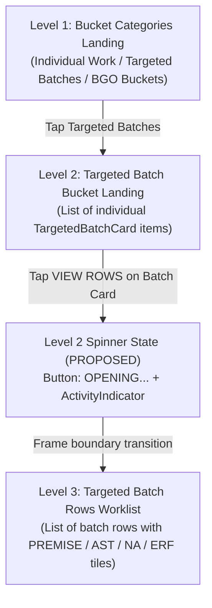

# Targeted Batch Card Opening Spinner Assessment

## 1. Executive Summary

This technical assessment evaluates the requirement to add an immediate visual loading spinner and `OPENING...` button feedback to Level 2 individual Targeted Batch cards when a user taps **VIEW ROWS** to open the Level 3 Batch Rows view in **iREPS Mobile**.

The assessment was performed on commit `27ba5d2` ("Improve Targeted Batch workorder action feedback") of repository `C:\dev\ireps-mobile`, with primary reference to screen component `WorkorderManagementSystem` in [my-workorders.js](file:///C:/dev/ireps-mobile/app/%28tabs%29/admin/operations/my-workorders.js).

### Key Findings
1. **Current Behavior**: Tapping **VIEW ROWS** on a Level 2 Targeted Batch card immediately invokes `openBucket(bucket)`, which synchronously sets `selectedBucket` state. On the next React render cycle, Level 2 (`TargetedBatchBucketLanding`) unmounts and Level 3 (`TargetedBatchRowsWorklist`) mounts. No visual loading state is displayed inside the tapped Level 2 card button during the transition window before Level 3 renders.
2. **Missing Loading Feedback**: While Level 1 bucket cards and Level 3 row action tiles already have working loading indicators, the Level 2 card transition to Level 3 lacks an immediate button spinner, leaving a brief visual latency gap on low-end devices or during heavy UI thread frame updates.
3. **Architecture Compatibility**: Adding an `openingTargetedBatchId` state and deferring `setSelectedBucket(bucket)` across a double `requestAnimationFrame` boundary allows the tapped card's **VIEW ROWS** button to paint an immediate `ActivityIndicator` and `OPENING...` label, block duplicate/competing taps, and provide a seamless visual handover to Level 3's existing `"Loading Targeted Batch rows..."` state.
4. **Scope Integrity**: The proposed patch requires changes exclusively in [my-workorders.js](file:///C:/dev/ireps-mobile/app/%28tabs%29/admin/operations/my-workorders.js). No schema, Firestore, API, streaming, routing, Level 1, Level 3 action-tile, or whole-batch ACCEPT/REJECT changes are required.

---

## 2. Files Inspected

### Mobile Repository (`C:\dev\ireps-mobile`)
- [skills.md](file:///C:/dev/ireps-mobile/skills.md) — iREPS Mobile repository housekeeping rules.
- [my-workorders.js](file:///C:/dev/ireps-mobile/app/%28tabs%29/admin/operations/my-workorders.js) — Primary WMS screen containing Level 1, Level 2, and Level 3 components and state management.
- [targetedBatchApi.js](file:///C:/dev/ireps-mobile/src/redux/targetedBatchApi.js) — RTK Query endpoints `useGetTargetedBatchBucketsQuery` and `useGetTargetedBatchRowsQuery`.
- [targetedBatchActions.js](file:///C:/dev/ireps-mobile/src/features/targetedBatches/targetedBatchActions.js) — Targeted Batch action state resolution and reference snapshot helpers.

### Web Repository (`C:\dev\ireps-web`)
- [skills.md](file:///C:/dev/ireps-web/skills.md) — iREPS Web repository rules and API streaming policy.

---

## 3. Confirmed Three-Level Flow

The WMS user flow is structured into three strict levels inside [my-workorders.js](file:///C:/dev/ireps-mobile/app/%28tabs%29/admin/operations/my-workorders.js):



1. **Level 1 — Bucket Cards (`BucketTypeLanding`)**: Displays cards for Individual Work, Targeted Batches, and BGO Buckets. Has working loading indicators (`ActivityIndicator` when preparing). **No change required.**
2. **Level 2 — Targeted Batches List (`TargetedBatchBucketLanding`)**: Displays a list of accepted/eligible Targeted Batch cards (`TargetedBatchCard`). Each card features action buttons (**ACCEPT**, **REJECT**, **VIEW ROWS**). **Subject of this assessment.**
3. **Level 3 — Batch Rows Worklist (`TargetedBatchRowsWorklist`)**: Displays individual meter rows for the selected Targeted Batch, with interactive tiles (**PREMISE**, **AST**, **NA**, **ERF**). Level 3 already has working row action-tile spinners and an existing screen-level `"Loading Targeted Batch rows..."` indicator. **No change required to Level 3 action tiles or Level 3 loading indicators.**

---

## 4. Current Level 2 Card Rendering

### Component & Hierarchy
- Component: `TargetedBatchCard` ([my-workorders.js:L3120-L3306](file:///C:/dev/ireps-mobile/app/%28tabs%29/admin/operations/my-workorders.js#L3120-L3306))
- Container: `TargetedBatchBucketLanding` ([my-workorders.js:L2970-L3041](file:///C:/dev/ireps-mobile/app/%28tabs%29/admin/operations/my-workorders.js#L2970-L3041))
- List Rendering Mechanism: `ScrollView` containing `buckets.map(...)` ([my-workorders.js:L2983, L3026](file:///C:/dev/ireps-mobile/app/%28tabs%29/admin/operations/my-workorders.js#L2983-L3026))

### List Update Mechanics
Because Level 2 cards are rendered inside a standard `<ScrollView>` using `.map()` (rather than a VirtualizedList like `FlatList` or `FlashList`), all child cards re-render automatically whenever parent state in `WorkorderManagementSystem` or `TargetedBatchBucketLanding` changes. An `extraData` prop is neither applicable nor required for Level 2 card updates.

---

## 5. Current VIEW ROWS Action Flow

Tracing the exact code execution when a user taps **VIEW ROWS**:

1. **Button Tap**: User presses `<Pressable style={[styles.actionBtn, styles.executeBtn]} onPress={() => onOpenBucket(bucket)}>` ([my-workorders.js:L3279-L3287](file:///C:/dev/ireps-mobile/app/%28tabs%29/admin/operations/my-workorders.js#L3279-L3287)).
2. **Prop Delegation**: `onOpenBucket` is passed from `TargetedBatchBucketLanding` ([my-workorders.js:L2700](file:///C:/dev/ireps-mobile/app/%28tabs%29/admin/operations/my-workorders.js#L2700)) to `openBucket` in `WorkorderManagementSystem` ([my-workorders.js:L1867-L1913](file:///C:/dev/ireps-mobile/app/%28tabs%29/admin/operations/my-workorders.js#L1867-L1913)).
3. **Validation & State Set**: `openBucket(bucket)` checks `bucket?.permissions?.canViewRows === true`. If valid, it executes synchronously:
   ```javascript
   setPreparingBgoDetail(false);
   setSelectedBucket(bucket);
   setSelectedGroup(null);
   setStateFilter("ALL");
   ```
4. **View Switch**: `setSelectedBucket(bucket)` sets `selectedBucket`. On the immediately following render cycle:
   - `selectedTargetedBatchId` becomes `selectedBucket.id` ([my-workorders.js:L1019-L1022](file:///C:/dev/ireps-mobile/app/%28tabs%29/admin/operations/my-workorders.js#L1019-L1022)).
   - `showTargetedBatchRows` evaluates to `true` ([my-workorders.js:L2614-L2615](file:///C:/dev/ireps-mobile/app/%28tabs%29/admin/operations/my-workorders.js#L2614-L2615)).
   - Level 2 (`TargetedBatchBucketLanding`) unmounts and Level 3 (`TargetedBatchRowsWorklist`) mounts ([my-workorders.js:L2733-L2746](file:///C:/dev/ireps-mobile/app/%28tabs%29/admin/operations/my-workorders.js#L2733-L2746)).
5. **Row Query Activation**: `useGetTargetedBatchRowsQuery` has `skip: targetedBatchRowsQuerySkipped` ([my-workorders.js:L1152-L1168](file:///C:/dev/ireps-mobile/app/%28tabs%29/admin/operations/my-workorders.js#L1152-L1168)). Setting `selectedTargetedBatchId` makes `targetedBatchRowsQuerySkipped` `false`, activating the Firestore query/stream for the batch rows.

---

## 6. Existing Level 3 Loading Behaviour

Level 3 already contains a dedicated loading view inside `TargetedBatchRowsWorklist` ([my-workorders.js:L3780-L3789](file:///C:/dev/ireps-mobile/app/%28tabs%29/admin/operations/my-workorders.js#L3780-L3789)):

```javascript
{isLoading ? (
  <View style={styles.detailPreparingCard}>
    <ActivityIndicator size="small" color="#2563eb" />
    <Text style={styles.detailPreparingTitle}>
      Loading Targeted Batch rows...
    </Text>
    <Text style={styles.detailPreparingText}>
      Preparing the accepted ERF worklist for premise discovery.
    </Text>
  </View>
) : ...}
```

This ensures that once Level 3 mounts, if rows are not yet cached or loaded from Firestore, the user sees an explicit `"Loading Targeted Batch rows..."` message.

---

## 7. Confirmed Findings

Below are answers to the 25 specific assessment questions:

1. **Level 2 Component**: `TargetedBatchCard` ([my-workorders.js:L3120](file:///C:/dev/ireps-mobile/app/%28tabs%29/admin/operations/my-workorders.js#L3120)) rendered within `TargetedBatchBucketLanding` ([my-workorders.js:L2970](file:///C:/dev/ireps-mobile/app/%28tabs%29/admin/operations/my-workorders.js#L2970)).
2. **VIEW ROWS Button Element**: `<Pressable style={[styles.actionBtn, styles.executeBtn]} onPress={() => onOpenBucket(bucket)} disabled={deciding}><Text style={styles.executeBtnText}>VIEW ROWS</Text></Pressable>` inside `TargetedBatchCard` ([my-workorders.js:L3279-L3287](file:///C:/dev/ireps-mobile/app/%28tabs%29/admin/operations/my-workorders.js#L3279-L3287)).
3. **Complete Code Flow**: Button press → `onOpenBucket` prop → `openBucket(bucket)` handler → permission check → `setSelectedBucket(bucket)` → re-render → `selectedTargetedBatchId` populated → `targetedBatchRowsQuerySkipped` becomes `false` → `useGetTargetedBatchRowsQuery` activates → JSX switches to `TargetedBatchRowsWorklist`.
4. **Exact Handler**: `openBucket(bucket)` ([my-workorders.js:L1867](file:///C:/dev/ireps-mobile/app/%28tabs%29/admin/operations/my-workorders.js#L1867)).
5. **Immediate Replacement**: Yes, calling `setSelectedBucket(bucket)` synchronously updates React state, unmounting Level 2 on the next render pass.
6. **Row Query Activation**: The query becomes active when `selectedTargetedBatchId` changes from `null` to a valid batch ID via `setSelectedBucket(bucket)`.
7. **Existing States**:
   - *Selected Targeted Batch*: `selectedBucket` ([my-workorders.js:L954](file:///C:/dev/ireps-mobile/app/%28tabs%29/admin/operations/my-workorders.js#L954)).
   - *Rows Loading*: `isLoadingTargetedBatchRows` ([my-workorders.js:L1159](file:///C:/dev/ireps-mobile/app/%28tabs%29/admin/operations/my-workorders.js#L1159)).
   - *Rows Fetching*: Managed internally by RTK Query.
   - *Rows Streaming*: RTK Query `onSnapshot` Firestore subscription ([targetedBatchApi.js:L426](file:///C:/dev/ireps-mobile/src/redux/targetedBatchApi.js#L426)).
   - *Rows Ready*: `targetedBatchRowsData` ([my-workorders.js:L1158](file:///C:/dev/ireps-mobile/app/%28tabs%29/admin/operations/my-workorders.js#L1158)).
   - *Rows Error*: `targetedBatchRowsError` ([my-workorders.js:L1160](file:///C:/dev/ireps-mobile/app/%28tabs%29/admin/operations/my-workorders.js#L1160)).
8. **Level 3 Loading Render**: Yes, Level 3 already renders `<ActivityIndicator>` with `"Loading Targeted Batch rows..."` ([my-workorders.js:L3780-L3789](file:///C:/dev/ireps-mobile/app/%28tabs%29/admin/operations/my-workorders.js#L3780-L3789)).
9. **Existing Level 2 Opening State**: No state currently exists for Level 2 card opening. `processingTargetedBatchAction` is used exclusively for whole-batch ACCEPT/REJECT mutations, and `pendingTargetedBatchAction` is used exclusively for Level 3 row action tiles.
10. **Scope of `processingTargetedBatchAction`**: Restricted strictly to whole-batch ACCEPT/REJECT mutations ([my-workorders.js:L2043-L2119](file:///C:/dev/ireps-mobile/app/%28tabs%29/admin/operations/my-workorders.js#L2043-L2119)). Reusing it for VIEW ROWS would inappropriately mix server mutation logic with UI navigation.
11. **Level 2 List Mechanism**: Rendered with `<ScrollView>` and `.map` ([my-workorders.js:L2983, L3026](file:///C:/dev/ireps-mobile/app/%28tabs%29/admin/operations/my-workorders.js#L2983-L3026)).
12. **`extraData` Prop**: Not required or applicable because Level 2 uses `ScrollView` and `.map`.
13. **Technical Soundness of Sequence**: Highly sound. Setting `openingTargetedBatchId` → painting frame → calling `setSelectedBucket` → mounting Level 3 provides an instant visual response while preserving established component hierarchy.
14. **Frame Boundary Requirement**: A double `requestAnimationFrame` boundary (paint frame + preparation frame) is recommended. This matches the exact verified pattern used elsewhere in `my-workorders.js` ([my-workorders.js:L2574-L2608](file:///C:/dev/ireps-mobile/app/%28tabs%29/admin/operations/my-workorders.js#L2574-L2608)).
15. **Loading Identity**: A simple string `openingTargetedBatchId` (or ref-keyed request object) is sufficient.
16. **Card Disabling Scope**: All Level 2 cards should be temporarily disabled while any card is opening (`disabled = Boolean(openingTargetedBatchId) || ...`), preventing competing selections.
17. **Rapid-Tap Behavior**:
    - *Same button rapid tap*: Blocked immediately by `disabled` flag on button tap.
    - *Batch A then Batch B tap*: Blocked because all card buttons become disabled upon initial tap.
    - *VIEW ROWS during ACCEPT/REJECT*: Blocked because `deciding` / `processingTargetedBatchAction` disables card buttons.
18. **Required Clear Paths**:
    - Validation check failure (e.g. `canViewRows !== true`).
    - Selected batch removed from live stream.
    - Selected batch becoming ineligible.
    - User presses Back to return to Level 1.
    - Screen loses focus (`useFocusEffect` cleanup).
    - Screen unmounts (`useEffect` cleanup).
    - Level 3 taking ownership (`setSelectedBucket` called or returning via `backToBuckets`).
19. **Safest Moment to Clear State**: Clear `openingTargetedBatchId` when `setSelectedBucket` executes, and ensure it is cleared in `backToBuckets()`, `backToBucketCategories()`, `useFocusEffect` cleanup, and `useEffect` unmount cleanup.
20. **Clearing on Unmount/Return**: Essential. If `openingTargetedBatchId` is not cleared when returning from Level 3 to Level 2 (`backToBuckets()`), Level 2 cards would remain stuck in `OPENING...` state.
21. **Visual Handover Quality**: Seamless handover from card spinner to Level 3 loading screen.
22. **Post-Acceptance Navigation (VIEW TRANSACTIONS)**: Remains completely unchanged.
23. **Smallest Safe Implementation**: Add `openingTargetedBatchId` state to `WorkorderManagementSystem`, update `openBucket` to set opening state and schedule `setSelectedBucket` via double `requestAnimationFrame`, update `TargetedBatchCard` to render `ActivityIndicator` & `OPENING...` when opening, and clear state on navigation cleanup.
24. **Files That Would Change**: Exactly one file: [my-workorders.js](file:///C:/dev/ireps-mobile/app/%28tabs%29/admin/operations/my-workorders.js).
25. **Fact vs Hypothesis Separation**: See Section 7 & Section 14.

---

## 8. Opening-State Lifecycle Assessment

The proposed lifecycle for the Level 2 card opening state:

```
[User Taps VIEW ROWS]
       │
       ▼
[Validation Passed?] ──NO──► [Alert Error & Cancel]
       │
      YES
       ▼
[setOpeningTargetedBatchId(bucket.id)]  <── Button immediately changes to OPENING... + Spinner
       │
       ▼
[requestAnimationFrame (Frame 1: Paint)]
       │
       ▼
[requestAnimationFrame (Frame 2: Prep)]
       │
       ▼
[setSelectedBucket(bucket)] ──► [Level 2 Unmounts / Level 3 Mounts]
       │
       ▼
[clearOpeningTargetedBatchId()]
```

---

## 9. Rapid-Tap and Stream Race Assessment

- **Duplicate Taps**: Disabling all card actions when `openingTargetedBatchId` is non-null prevents race conditions where multiple open calls are queued.
- **Stream Invalidation**: If the live Firestore snapshot updates or deletes the targeted batch while `openingTargetedBatchId` is pending, the request key guard cancels the frame sequence and clears the opening state safely without crashing.

---

## 10. Minimal Safe Patch Recommendation

### Proposed Code Changes in `my-workorders.js`

1. **Add State and Refs in `WorkorderManagementSystem`**:
   ```javascript
   const [openingTargetedBatchId, setOpeningTargetedBatchId] = useState(null);
   const targetedBatchOpenPaintFrameRef = useRef(null);
   const targetedBatchOpenPrepFrameRef = useRef(null);
   ```

2. **Add Frame Cleanup Helper**:
   ```javascript
   const cancelTargetedBatchOpenFrames = useCallback(() => {
     if (targetedBatchOpenPaintFrameRef.current !== null) {
       cancelAnimationFrame(targetedBatchOpenPaintFrameRef.current);
       targetedBatchOpenPaintFrameRef.current = null;
     }
     if (targetedBatchOpenPrepFrameRef.current !== null) {
       cancelAnimationFrame(targetedBatchOpenPrepFrameRef.current);
       targetedBatchOpenPrepFrameRef.current = null;
     }
   }, []);
   ```

3. **Update `openBucket`**:
   ```javascript
   if (bucket?.bucketType === "TBB") {
     if (bucket?.permissions?.canViewRows !== true) {
       Alert.alert("Targeted Batch Locked", "This Targeted Batch must be accepted before its rows can be opened for field execution.");
       return;
     }
     setOpeningTargetedBatchId(bucket.id);
     cancelTargetedBatchOpenFrames();

     targetedBatchOpenPaintFrameRef.current = requestAnimationFrame(() => {
       targetedBatchOpenPaintFrameRef.current = null;
       targetedBatchOpenPrepFrameRef.current = requestAnimationFrame(() => {
         targetedBatchOpenPrepFrameRef.current = null;
         if (!targetedBatchScreenMountedRef.current) return;
         setPreparingBgoDetail(false);
         setSelectedBucket(bucket);
         setSelectedGroup(null);
         setStateFilter("ALL");
         setOpeningTargetedBatchId(null);
       });
     });
     return;
   }
   ```

4. **Update `TargetedBatchCard` Props & Rendering**:
   Pass `openingTargetedBatchId` to `TargetedBatchCard`. In `TargetedBatchCard`:
   ```javascript
   const isOpening = openingTargetedBatchId === bucket?.id;
   const disabled = deciding || processingThisBatch || Boolean(openingTargetedBatchId) || !fieldWorkorderActor;
   ```
   Inside the `canView` button rendering:
   ```javascript
   {canView ? (
     <Pressable
       style={[styles.actionBtn, styles.executeBtn, disabled && styles.actionDisabled]}
       onPress={() => onOpenBucket(bucket)}
       disabled={disabled}
     >
       {isOpening ? <ActivityIndicator size="small" color="#ffffff" style={{ marginRight: 6 }} /> : null}
       <Text style={styles.executeBtnText}>
         {isOpening ? "OPENING..." : "VIEW ROWS"}
       </Text>
     </Pressable>
   ) : null}
   ```

---

## 11. Files That Would Change

- [my-workorders.js](file:///C:/dev/ireps-mobile/app/%28tabs%29/admin/operations/my-workorders.js) (Only)

---

## 12. Risks and Regression Concerns

| Risk | Mitigation |
| :--- | :--- |
| Stuck `OPENING...` spinner if user navigates back | Explicitly clear `openingTargetedBatchId` in `backToBuckets`, `backToBucketCategories`, `useFocusEffect`, and `useEffect` unmount handlers. |
| Double taps triggering multiple state updates | Button disabled immediately when `openingTargetedBatchId` is set. |
| Visual frame jitter during transition | Nested double `requestAnimationFrame` ensures visible paint before state mutation. |
| Interaction with ACCEPT/REJECT buttons | `disabled` check includes `Boolean(openingTargetedBatchId)`. |

---

## 13. Manual Test Matrix

| # | Test Scenario | Expected Outcome | Pass/Fail Criteria |
| :--- | :--- | :--- | :--- |
| 1 | Tap VIEW ROWS on Batch A | Spinner appears in button, text changes to `OPENING...`, Level 3 opens cleanly. | Visual spinner paints before Level 3 transition. |
| 2 | Rapidly double-tap VIEW ROWS on Batch A | Second tap is ignored/blocked. | Only single open sequence executes. |
| 3 | Tap Batch A then immediately tap Batch B | Batch B tap is ignored while Batch A is opening. | Batch B tap disabled. |
| 4 | Open batch with cached rows | Button shows `OPENING...`, Level 3 opens immediately with rows. | Clean transition. |
| 5 | Open batch requiring row fetch | Button shows `OPENING...`, Level 3 opens with `"Loading Targeted Batch rows..."`. | Handover to Level 3 spinner. |
| 6 | Batch disappears from stream during opening | Opening cancels gracefully without crash. | No unhandled state error. |
| 7 | Batch becomes ineligible during opening | Permission check blocks opening. | Alert shown, spinner cleared. |
| 8 | Row query returns error | Level 3 error card displays error message. | Error handled in Level 3. |
| 9 | User presses Back during opening | Opening cancelled, Level 2 remains active. | State cleared. |
| 10 | Screen loses focus during opening | Opening frames cancelled. | No state leaks across tabs. |
| 11 | User returns from Level 3 to Level 2 | Level 2 card displays `VIEW ROWS` in default unblocked state. | No stuck `OPENING...` spinner. |
| 12 | ACCEPT/REJECT processing | Unchanged, whole-batch decision processing works normally. | Mutation behavior intact. |
| 13 | VIEW TRANSACTIONS after acceptance | Unchanged, opens batch directly. | Navigation intact. |
| 14 | Level 1 bucket-card spinners | Unchanged. | Level 1 behavior intact. |
| 15 | Level 3 PREMISE/AST/NA/ERF spinners | Unchanged. | Level 3 action tiles intact. |

---

## 14. Final Recommendation

The proposed Level 2 Targeted Batch card opening spinner requirement is **technically sound, low risk, and highly localized**.

Implementation should follow the minimal patch pattern detailed in Section 10, affecting solely [my-workorders.js](file:///C:/dev/ireps-mobile/app/%28tabs%29/admin/operations/my-workorders.js).
